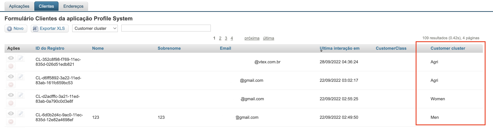
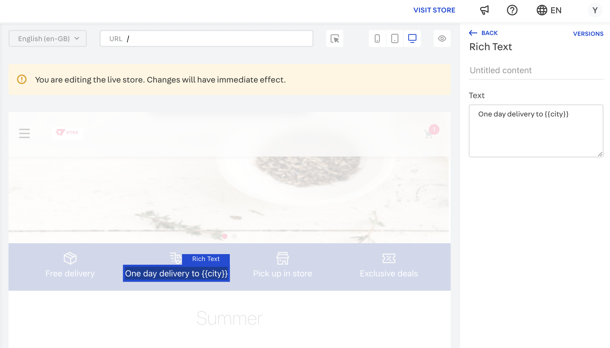
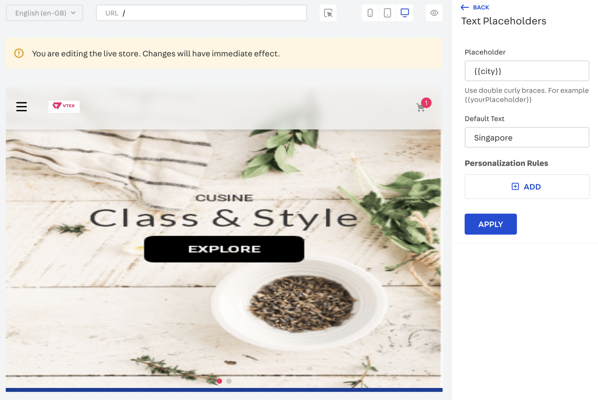
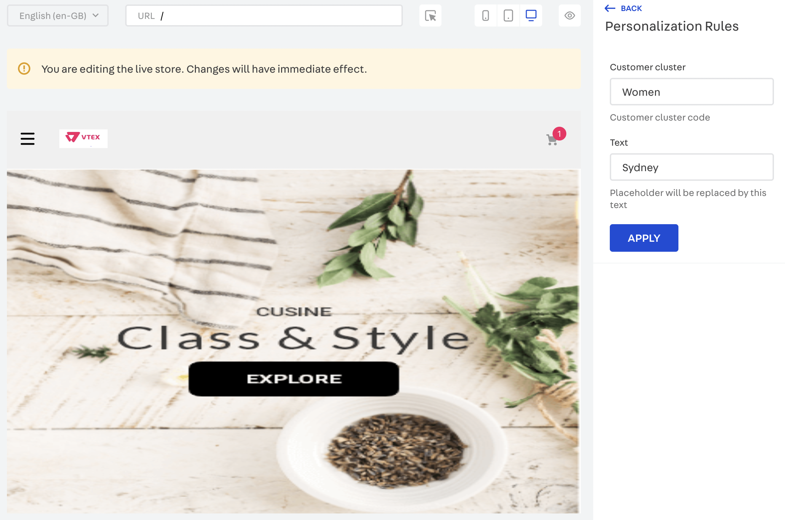
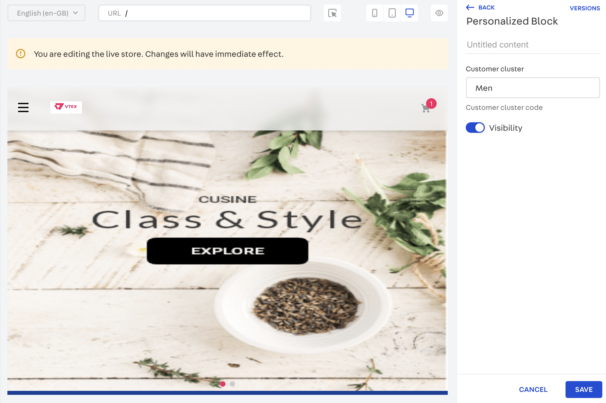
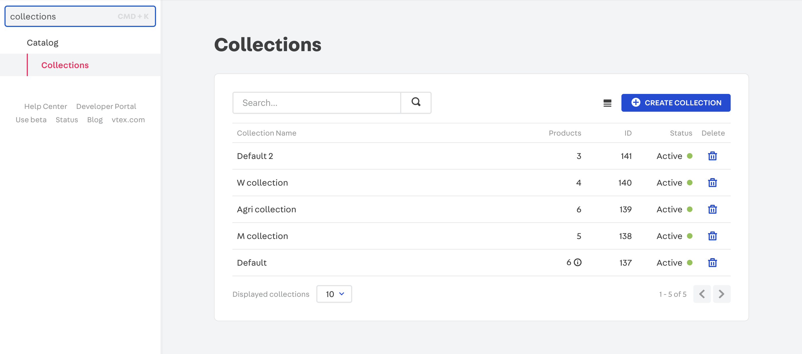
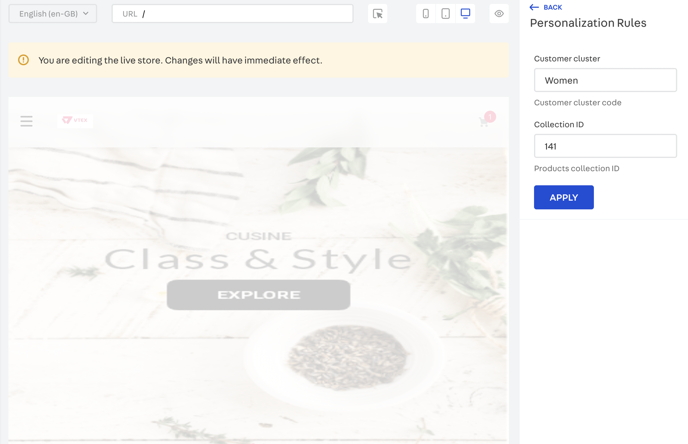
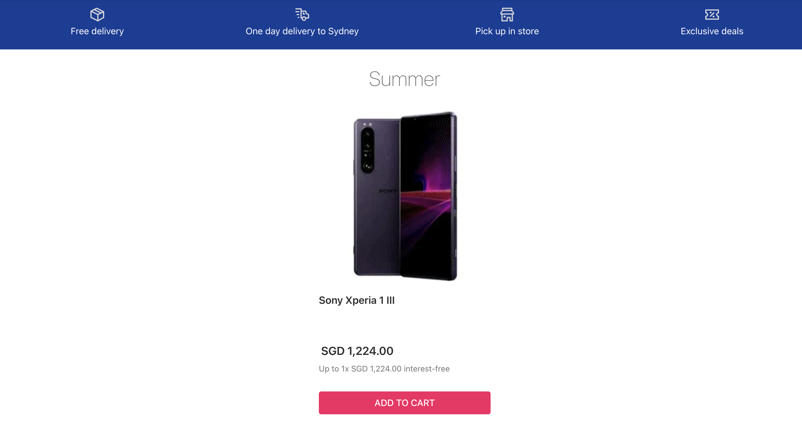

📢 Use this project, [contribute](https://github.com/vtex-apps/adobe-launch-pixel) to it or open issues to help evolve it using [Store Discussion](https://github.com/vtex-apps/store-discussion).

# Onsite Personalization

Integrate your store with the personalized online buying experience.

## Installation and configuration

### Step 1 - Installing Onsite Personalization app
Install `vtexasia.onsite-personalization@0.x` in your account.

    
    vtex install vtexasia.onsite-personalization@0.x
    

### Step 2 - Setup Onsite Personalization app
1. To set up the Onsite Personalization app, you need to add it to your store theme's manifest.json, under `peerDependencies` section.

```json
  {
    "vendor": "vtexasia",
    "name": "store-theme",
    "version": "0.0.6",
    "builders": {
      "styles": "2.x",
      "store": "0.x",
      "sitemap": "0.x",
      "docs": "0.x"
    },
    "mustUpdateAt": "2018-09-05",
    "scripts": {
      "postreleasy": "vtex publish --verbose"
    },
    "dependencies": {
      "vtex.store": "2.x",
      "vtex.store-header": "2.x",
      "vtex.product-summary": "2.x",
      ...
    },
    "peerDependencies": {
      "vtexasia.onsite-personalization": "0.x"
    },
    "$schema": "https://raw.githubusercontent.com/vtex/node-vtex-api/master/gen/manifest.schema"
  }
```

2. Add the event handler block, personalized-events-handler, which manages events involving user data changing, must be located at the top of the page block.

  For example, in home.json:

  ```json
  {
    "store.home": {
      "blocks": [
        "personalized-events-handler",
        "info-card#home",
        "rich-text#question",
        "rich-text#link",
        "newsletter"
      ]
    }
  }
  ```
  
3. Add a `Customer cluster` field in the Client data entity in the Masterdata, this will help us to group the customers.

  

  Now you have successfully configured the app! 


## App functionality

There are three main functions of the app.

### Replace the text on the page based on the customer cluster

Add `personalized-text-replacer` to your store theme:

```json
  {
    "store.home": {
      "blocks": [
        "personalized-events-handler",
        "personalized-text-replacer#test",
        "info-card#home",
        "rich-text#question",
        "rich-text#link",
        "newsletter"
      ]
    },

    "personalized-text-replacer#test": {

    },
  }
```

Inside your CMS Site Editor, open `Personalized Text Replacer`, add a text placeholder to the desired place, and use double curly braces for the text to be replaced later, e.g. {{city}}.



Then open the Personalized Text Replacer, and add `Text Placeholders`.




After that add `Personalization Rules`, where you can set specific text for the target customer group. So for the customers in the customer cluster `Women`, they will see `Sydney`, and all other customers will see `Singapore`.




You can add multiple `Text Placeholders`.

### Control the visibility of child blocks based on customer cluster

Add `personalized-block` to your store theme, and add children blocks under the `personalized-block` (can be any block):

```json
  {
    "store.home": {
      "blocks": [
        "personalized-events-handler",
        "personalized-text-replacer#test",
        "personalized-block#test",
        "info-card#home",
        "rich-text#question",
        "rich-text#link",
        "newsletter"
      ]
    },

    "personalized-text-replacer#test": {

    },

    "personalized-block#test": {
      "children": ["info-card#test"]
    },
  }
```

Inside your CMS Site Editor, open `Personalized Block`, and select the visibility for the target customer cluster.



So only customers from customer cluster `Men` will be able to see the `info-card`. Similarly, if I unselect the `visibility`, only customers from customer cluster `Men` will be unable to see the `info-card`.


### Control the collection of displayed products based on the customer cluster

Add `personalized-collection` to your store theme, add product shelf as a child block:

```json
  {
    "store.home": {
      "blocks": [
        "personalized-events-handler",
        "personalized-text-replacer#test",
        "personalized-block#test",
        "personalized-collection#test",
        "info-card#home",
        "rich-text#question",
        "rich-text#link",
        "newsletter"
      ]
    },

    "personalized-text-replacer#test": {

    },

    "personalized-block#test": {
      "children": ["info-card#test"]
    },

    "personalized-collection#test": {
      "blocks": ["product-summary.shelf"],
      "props": {
        "showLoading": true,
        "maxItems": 5
      },
      "children": ["slider-layout#demo-products"]
    },
    "product-summary.shelf": {
      "children": [
        "product-summary-name",
        "product-summary-description",
        "product-summary-image",
        "product-summary-price"
      ]
    },
  }
```

Create Collections for the products under the Catalog.



Inside your CMS Site Editor, open `Personalized Collection`, add `Personalization Rules`.



So only customers from customer cluster `Women` will be able to see the products under Collection 141 in the store's product shelf.



You can add multiple `Personalization Rules`.
